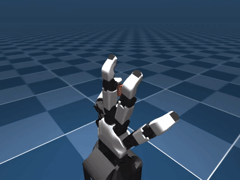

# ORCA Agent Task Generation

This project provides a constrained Agent pipeline for turning a structured
robot-hand task specification into a usable, validated, and trainable
MuJoCo/Gymnasium reinforcement-learning environment.

It is built on [`LynnUoE/orca_sim`](https://github.com/LynnUoE/orca_sim) commit
`02571cf7fbec1e57de615e61949d504440e2646a` and currently targets the ORCA v1
right hand.

## 1. What the Agent does

### User input

The executable input is a versioned YAML **TaskSpec**. It describes:

- the environment ID and ORCA hand version;
- object geometry, mass, friction, and initial position;
- observation and action settings;
- reward terms;
- success, failure, randomization, and safety conditions;
- a gesture-reference file and its provenance.

A coding Agent such as Codex can translate a natural-language task request into
this YAML, but the repository itself deliberately starts from the TaskSpec. The
validated YAML is the durable and reproducible Agent output.

### What happens next

| Step | Agent action | Purpose |
|---:|---|---|
| 1 | Parse the TaskSpec | Load the requested task in a machine-readable form. |
| 2 | Validate schema and semantics | Reject missing/unknown fields, NaN/Inf, unsupported versions, invalid geometry, absolute paths, and path traversal. |
| 3 | Load the gesture reference | Check the 17-DoF pose/control format, timestamps, hand version, source label, and provenance. |
| 4 | Generate MuJoCo artifacts | Deterministically create a portable `scene.xml` and normalized `task_spec.yaml`. |
| 5 | Create a manifest | Record the TaskSpec SHA-256, source commit, generation attempt, file list, and validation status. |
| 6 | Register the task | Expose the generated task as a normal Gymnasium environment. |
| 7 | Run static and runtime checks | Check XML, packaged paths, Gymnasium API behavior, seeded resets, finite values, and stable shapes. |
| 8 | Run behavior and anti-cheating checks | Compare zero, random, and scripted policies and reject false success from one-finger contact, transient collision, closed-hand pose, or a dropped object. |
| 9 | Train and evaluate PPO | Optionally prove that the observation/action/reward design can actually be learned, using three seeds and matching VecNormalize statistics. |
| 10 | Package the result | Produce reports, metrics, videos, and a wheel that is tested in a clean virtual environment. |

```text
Task request
    -> TaskSpec YAML
    -> schema and safety validation
    -> MuJoCo generation
    -> Gymnasium registration
    -> physics and behavior gates
    -> optional PPO learnability test
    -> reports, videos, and installable package
```

### Final output

For each accepted task, the pipeline produces:

```text
src/orca_sim/taskgen/generated/<task>/
├── scene.xml
├── task_spec.yaml
├── manifest.json
└── validation_report.json

artifacts/<task>/
├── behavior_acceptance.json
├── PPO evaluation metrics (when trained)
└── success/failure videos
```

PPO is not used to generate the environment. It is an optional acceptance step
that demonstrates the generated environment can be learned rather than only
completed by a hand-written controller.

## 2. Example: PinchAndHold

The included example asks the ORCA v1 right hand to pinch a small cylinder with
the thumb and index finger.

The full input is
[`pinch_and_hold_v0.yaml`](src/orca_sim/taskgen/specs/pinch_and_hold_v0.yaml).
A shortened excerpt is shown below:

```yaml
schema_version: 1
task:
  env_id: PinchAndHold-v0
  family: pinch_and_hold
  hand_version: v1
  side: right
  object:
    shape: cylinder
    radius: 0.006
    half_length: 0.012
    mass: 0.015
  control:
    action_mode: relative
    action_scale: 0.15
  success:
    require_thumb_contact: true
    require_index_contact: true
    hold_steps: 10
  failure:
    drop_height: 0.12
    terminate_on_drop: true
```

Success requires all of the following for 10 consecutive simulation steps:

```text
thumb-object contact
AND index-object contact
AND object inside the workspace
AND object not dropped
```

One-finger contact, a closed hand without contact, a short collision, or contact
after dropping the object does not count as success.

Two environments are generated through the same generic environment class:

- `PinchAndHold-v0`
- `PinchAndHoldSmall-v0`, with different object/reset parameters

### Measured results

| Evaluation | Result |
|---|---:|
| Full test suite | 59 passed |
| Zero-policy success | 0% |
| Random-policy success | 3% |
| Scripted-policy success | 100% |
| PPO success, seeds 0/1/2 | 100% / 100% / 100% |
| PPO success with mild randomization | 100% / 100% / 95% |
| Random runtime stress | 10,000 finite, shape-stable steps |
| Clean-wheel installation | PASS |

#### PPO-trained policy



[Success MP4](artifacts/pinch_and_hold/trained_policy_success.mp4) ·
[PPO metrics](artifacts/pinch_and_hold/ppo_acceptance.json)

#### Random-policy failure


[Failure MP4](artifacts/pinch_and_hold/random_failure.mp4) ·
[Behavior metrics](artifacts/pinch_and_hold/behavior_acceptance.json)

## 3. How to use it

### Install

Python 3.11 is recommended. The commands below use Windows PowerShell; on
Linux/macOS, replace `.\.venv\Scripts\python.exe` with the virtual environment's
`python` executable.

```powershell
git clone https://github.com/niujiazhen/orca-agent-taskgen.git
cd orca-agent-taskgen
py -3.11 -m venv .venv
.\.venv\Scripts\python.exe -m pip install -e ".[rl,dev]"
```

### Validate and generate the example

```powershell
.\.venv\Scripts\python.exe -m orca_sim.taskgen.cli validate src/orca_sim/taskgen/specs/pinch_and_hold_v0.yaml
.\.venv\Scripts\python.exe -m orca_sim.taskgen.cli generate src/orca_sim/taskgen/specs/pinch_and_hold_v0.yaml
.\.venv\Scripts\python.exe -m orca_sim.taskgen.cli check-static src/orca_sim/taskgen/generated/pinchandhold_v0
.\.venv\Scripts\python.exe -m orca_sim.taskgen.cli check-runtime src/orca_sim/taskgen/generated/pinchandhold_v0 --steps 10000 --seed 0
.\.venv\Scripts\python.exe -m orca_sim.taskgen.cli accept src/orca_sim/taskgen/generated/pinchandhold_v0 --artifacts artifacts/pinch_and_hold
```

### Use the generated Gymnasium environment

```python
import gymnasium as gym
from orca_sim import register_envs

register_envs()
env = gym.make("PinchAndHold-v0")

observation, info = env.reset(seed=0)
observation, reward, terminated, truncated, info = env.step(
    env.action_space.sample()
)

env.close()
```

### Create a parameter variant

Copy an existing spec, choose a unique `env_id`, and change object/reset
parameters. The same generator and generic environment class will produce a
separately registered task:

```powershell
Copy-Item src/orca_sim/taskgen/specs/pinch_and_hold_v0.yaml src/orca_sim/taskgen/specs/my_pinch_task.yaml
# Edit my_pinch_task.yaml, then validate and generate it.
.\.venv\Scripts\python.exe -m orca_sim.taskgen.cli validate src/orca_sim/taskgen/specs/my_pinch_task.yaml
.\.venv\Scripts\python.exe -m orca_sim.taskgen.cli generate src/orca_sim/taskgen/specs/my_pinch_task.yaml
```

The current MVP supports the `pinch_and_hold` task family. A genuinely new task
family requires a new generic environment template and corresponding validation
rules; it is not yet created automatically from unrestricted natural language.

### Train and evaluate PPO

```powershell
.\.venv\Scripts\python.exe -m orca_sim.taskgen.train --env-id PinchAndHold-v0 --name ppo_seed0 --seed 0 --timesteps 1000000 --n-envs 8 --no-subproc

.\.venv\Scripts\python.exe -m orca_sim.taskgen.evaluate --env-id PinchAndHold-v0 --model taskgen_runs/ppo_seed0/final_model.zip --vecnormalize taskgen_runs/ppo_seed0/vecnormalize.pkl --episodes 100 --seed 20000 --randomization-scale 0.0 --out taskgen_runs/ppo_seed0/eval_nominal.json
```

Always evaluate with the `vecnormalize.pkl` saved by the same training run.
Training checkpoints and normalization files are intentionally excluded from
Git; the repository contains the reproducible commands, metrics, and videos.

For the complete phase gates and evidence, see [`PLAN.md`](PLAN.md) and
[`artifacts/acceptance_report.md`](artifacts/acceptance_report.md).

This MVP does not include arm integration, screw threads, vision policies,
hardware deployment, or sim-to-real transfer. The included gesture reference is
explicitly marked synthetic; Cheng Su's
[`orcahand-retarget-experiments`](https://github.com/back2-thebasic/orcahand-retarget-experiments)
is used only as ORCA v1 pose and retargeting-configuration provenance.
