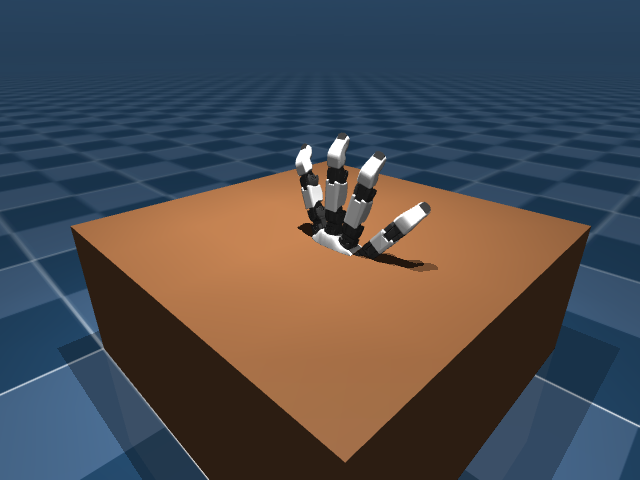
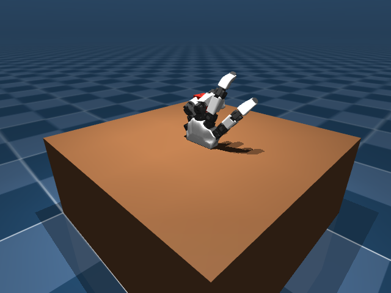
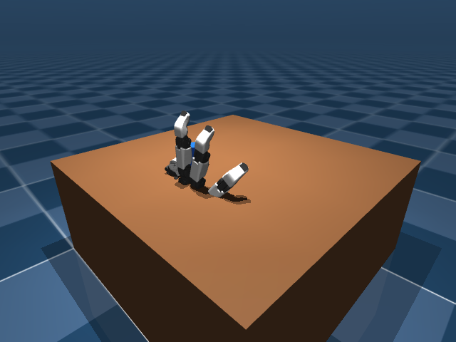

# ORCA Text-to-MuJoCo Environment Agent

This repository turns a plain-language hand task into a validated,
visualizable MuJoCo/Gymnasium reinforcement-learning environment.

The user describes a task in Chinese or English. The Codex Agent checks that
the request is supported, fills safe simulation defaults, creates a versioned
TaskSpec, generates the MuJoCo scene, runs non-learning feasibility checks, and
returns a ready-to-load task bundle with a screenshot and video.

```text
Natural-language request
  -> TaskSpec v2
  -> deterministic MuJoCo scene
  -> Gymnasium environment
  -> runtime and scripted feasibility checks
  -> interactive viewer + PNG/MP4 preview
```

The Agent generates environments only. It does not train PPO, create a policy,
or claim that a scripted preview is a learned result.

## Supported tasks

Version 0.2 supports one ORCA v1 right hand with a bounded kinematic 6DoF
wrist.

| Task family | Examples |
|---|---|
| `gesture` | open/half-close/fist, thumb-index pinch/release, three-finger grasp/release |
| `pick_up` | pick up a box, cylinder, or sphere |
| `pick_place` | pick up a supported object and place it in a target region |

The built-in object catalog contains boxes, cylinders, and spheres. Stacking,
insertion, tools, screws, external meshes, robot arms, and two-hand tasks are
rejected with a supported alternative instead of producing an unverified
environment.

The kinematic wrist and optional assistive-grasp transition are explicit
environment abstractions. They make single-hand tabletop tasks stable enough
for an RL environment, but they are not a robot-arm or sim-to-real dynamics
model.

## Install and use with Codex

Add the repository marketplace and install the plugin:

```powershell
codex plugin marketplace add niujiazhen/orca-agent-taskgen
codex plugin add orca-env-generator@orca-agent-taskgen
```

Start a new Codex task, then describe the environment you want:

```text
让灵巧手拿起桌上的红色方块
```

or:

```text
Pick up the blue cylinder and place it in the target region on the right.
```

Codex generates the bundle under `generated_tasks/`, runs the required checks,
creates the preview, and reports the exact directory and environment ID. Users
do not need to write YAML or configure an OpenAI API key.

When working from a clone, Codex also discovers the repository-level skill in
`.agents/skills/orca-env-generator/`.

## Python and CLI installation

Python 3.10 or newer is required.

```powershell
git clone https://github.com/niujiazhen/orca-agent-taskgen.git
cd orca-agent-taskgen
py -3.11 -m venv .venv
.\.venv\Scripts\python.exe -m pip install -e ".[visualization,dev]"
```

Generate directly from bounded natural language:

```powershell
orca-task generate-text "让灵巧手拿起桌上的红色方块" --output generated_tasks
orca-task check generated_tasks/<generated-directory>
orca-task preview generated_tasks/<generated-directory>
orca-task view generated_tasks/<generated-directory>
```

Or generate from a reviewed TaskSpec v2:

```powershell
orca-task validate src/orca_sim/taskgen/specs/v2_pick_place_cylinder.yaml
orca-task generate src/orca_sim/taskgen/specs/v2_pick_place_cylinder.yaml --output generated_tasks
```

## Load a generated environment

Load by bundle path:

```python
from orca_sim.taskgen import load_environment

env = load_environment(
    "generated_tasks/bluecylinderplace_v0",
    render_mode="human",
)
observation, info = env.reset(seed=0)
observation, reward, terminated, truncated, info = env.step(
    env.action_space.sample()
)
env.close()
```

Or register the bundle and use the standard Gymnasium interface:

```python
import gymnasium as gym
from orca_sim.taskgen import register_task_bundle

env_id = register_task_bundle("generated_tasks/bluecylinderplace_v0")
env = gym.make(env_id, render_mode="rgb_array")
```

The normalized action has 23 values: wrist translation `[3]`, wrist rotation
`[3]`, and ORCA joint targets `[17]`. The observation contains the wrist pose,
joint state, fingertip state, contact flags, object state, target, and task
stage. Exact labels and package requirements are stored in `manifest.json`.

## Generated task bundle

An accepted task contains:

```text
<task>/
├── request.txt
├── task_spec.yaml
├── scene.xml
├── manifest.json
├── validation_report.json
├── preview.png
├── preview.mp4
└── README.md
```

`orca-task check` verifies XML compilation, Gymnasium contracts, seeded reset
reproducibility, finite random stepping, false-success resistance, and scripted
reachability. The scripted controller uses only the public action space; it is
not a trained policy.

## Examples

The repository includes three reviewed TaskSpec v2 examples:

- [`v2_gesture_fist.yaml`](src/orca_sim/taskgen/specs/v2_gesture_fist.yaml)
- [`v2_pick_up_cube.yaml`](src/orca_sim/taskgen/specs/v2_pick_up_cube.yaml)
- [`v2_pick_place_cylinder.yaml`](src/orca_sim/taskgen/specs/v2_pick_place_cylinder.yaml)

| Gesture | Pick up | Pick and place |
|---|---|---|
|  |  |  |

[Gesture MP4](examples/generated/handfist_v0/preview.mp4) ·
[Pickup MP4](examples/generated/redcubepickup_v0/preview.mp4) ·
[Pick/place MP4](examples/generated/bluecylinderplace_v0/preview.mp4)

The legacy TaskSpec v1 PinchAndHold bundles remain loadable for compatibility,
but all new natural-language generation uses TaskSpec v2.

Gesture scenario definitions and retargeting configuration provenance come
from Cheng Su's
[`orcahand-retarget-experiments`](https://github.com/back2-thebasic/orcahand-retarget-experiments).
That repository provides configuration files and comparison videos rather than
joint trajectories, so the versioned joint targets here are calibrated and
validated locally.
